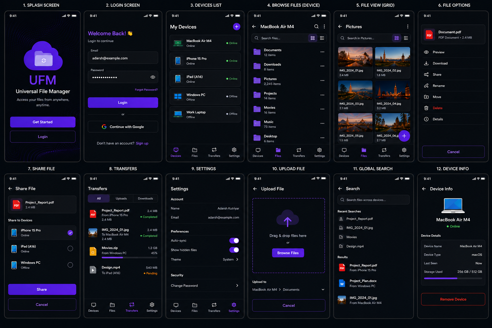

# Universal File Manager (UFM)

A cross-platform file management application that enables users to browse, manage, and transfer files securely across multiple devices using a unified interface.

> **Project Status:** 🚧 Active Development

---

## 📱 UI Preview

<p align="center">
  
</p>


## Features

- User Authentication
- Device Registration
- All of your devices will be listed on homescreen
- Real-time Device Discovery
- Online/Offline Device Status
- Android File Browsing
- File Preview
- Cross-device Communication
- Socket.IO based Real-time Updates
- Modular MVC Backend Architecture

---

## Tech Stack

### Mobile
- React Native

### Backend
- Node.js
- Express.js
- Socket.IO
- JWT Authentication

### Database
- MongoDB
- Mongoose

### Desktop Agent
- Node.js

---

## Project Structure

```
Universal-File-Manager/

├── backend/
├── mobile/
├── mac-agent/
├── README.md
```

---

## Architecture

```
Android App
        │
        │ REST API
        ▼
Node.js Backend
        │
        │
 MongoDB Database

        │
 Socket.IO

        │
Mac Agent
```

---

## Current Progress

### Completed

- User Authentication
- Device Registration
- Device Management APIs
- Real-time Online Status
- Android UI
- File Viewer
- MVC Backend
- cross platform file access(access your files of any devices from any device) (ongoing)

### In Progress

- Cross-device File Transfer
- Clipboard Synchronization
- Background Transfers
- Windows Client
- iOS Client

---

## Future Roadmap

- Windows Application
- macOS Native Application
- iOS Application
- File Synchronization
- Folder Synchronization
- End-to-End Encryption
- LAN Discovery
- Cross-platform Clipboard

---


## Author

**Adarsh Kutriyar**
B.Tech 2028, NIT Jalandhar
